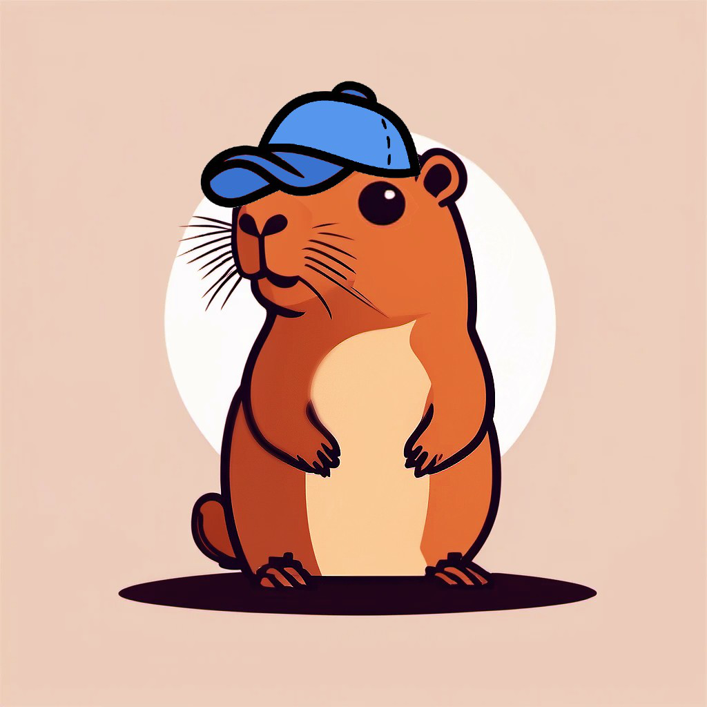

<p align="center">
  
</p>
  Capy is a MERN Stack web app that facilitates community by allowing users to create events and "pull up" to them!

# Technologies Used
MERN stack:
- MonogoDB
- Express.js
- React.js
- Node.js

React Router
Tailwind

# Instructions to Run

Clone the repository, then add the MONGO_URI environment variable to .env. Be sure to install all dependencies before running the application. 

```
touch .env
echo MONGO_URI="your uri here"
npm i 
npm run build
node server/server.js
```

# Features 
- creating events
- show location (click for google maps) and time
- heart and more details button
- animation and sound when pulling up
- more details module
- add and delete comments
- time structured events displaying 
- my events page that show pulled up/RSVP'd events and personally created events 
- profile to change profile picture
- add/remove friends
- sign in/sign up with security measures

# Resouces we used:
“Documentation - Tailwind CSS.” Documentation - Tailwind CSS, v2.tailwindcss.com/docs. Accessed 7 June 2024. 

“Find Icons with the Perfect Look & Feel.” Font Awesome, fontawesome.com/icons. Accessed 7 June 2024. 

“Mern Stack Tutorial #1 - What Is The Mern Stack?” YouTube, YouTube, 15 June 2022, www.youtube.com/watch?v=98BzS5Oz5E4&list=PL4cUxeGkcC9iJ_KkrkBZWZRHVwnzLIoUE. 

“MongoDB Explained in 10 Minutes | SQL vs NoSQL | Jumpstart.” YouTube, YouTube, 27 July 2021, www.youtube.com/watch?v=RGfFpQF0NpE.

“OK I Pull up Capybara.” YouTube, YouTube, 31 Aug. 2022, www.youtube.com/watch?v=s9oQRKsROF8&ab_channel=capybaross. 

“Upload and Retrieve Image on Mongodb Using Mongoose.” GeeksforGeeks, GeeksforGeeks, 30 Mar. 2023, www.geeksforgeeks.org/upload-and-retrieve-image-on-mongodb-using-mongoose/. 

"3 Column Layouts (Responsive, Flexbox & CSS Grid)" MatthewJamesTaylor, 8 Feb. 2022, https://matthewjamestaylor.com/3-column-layouts.

"AI art generation" HotpotAI, https://hotpot.ai/art-generator.
  (For logo generation)
  
Theresa Jiang for Capybara Loading Screen Artwork


# Group Members and Emails
Raymond Kao (Oceanspray21) - rmykao@g.ucla.edu, oogaboogamail123@gmail.com, rmykao@gmail.com

Benjamin Man (benman604) - benjamin.man1001@gmail.com

Jason Jiang (Zhaotjson) - jasontomjiang@gmail.com

Anirudh Kannan - akannan05@g.ucla.edu

RohanAdwankar - rohan.adwankar@gmail.com

Princeton Liu - hiprincetonliu@gmail.com
